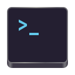

# King’s Cross

A minimal terminal for GNOME

KGX is supposed to be a simple terminal emulator for the average user to carry out simple cli tasks and aims to be a ‘core’ app for GNOME/Phosh

We are not however trying to replace GNOME Terminal/Tilix, these advanced tools are great for developers and administrators, rather kgx aims to serve the casual linux user who rarely needs a terminal

## Why the name?

KGX is the station code for [King’s Cross](https://www.nationalrail.co.uk/stations_destinations/kgx.aspx),
the London [*terminus*](https://youtu.be/8eXj97stbG8?t=25) of the East Coast Main Line

Not as cryptic [as some](https://wiki.debian.org/WhyTheName) but admittedly not as obvious as it could be.
Naming things [is hard](https://www.karlton.org/2017/12/naming-things-hard/). An explination: [National Rail](http://www.nationalrail.co.uk/) manages railway infrastructure in [Great Britain](https://en.wikipedia.org/wiki/Great_Britain) and to this end assigns codes to each station. For King’s Cross that code is KGX, so there you go - it’s a terminal emulator named after a real world ‘terminal’

### Railway Nerds

So of you will notice the icon is an [Underground Roundel](https://tfl.gov.uk/corporate/about-tfl/culture-and-heritage/art-and-design/the-roundel), clearly KGX isn't part of TfL’s network (though, of course, King’s Cross St Pancras - the Underground station - is). Unfortunatly it’s awfully hard to draw a simple icon for King’s Cross (and without copyright concerns) and very few would recognise it.

We did experiment with a centre aligned ~ (as you would expect for a station roundel) but we felt left aligned >_ better represented a terminal

## Roadmap

- [ ] ‘API’ compatible with GNOME Terminal
    - [ ] Command line flags *Partial, supports -e/--command and --working-directory*
- [X] Command done notifications
- [X] ‘root mode’ turns red when sudo/su/pkexec is active in the terminal
- [X] ‘remote mode’ turns (purple?) when ssh is in use
- [ ] Other bash/shell integrations
